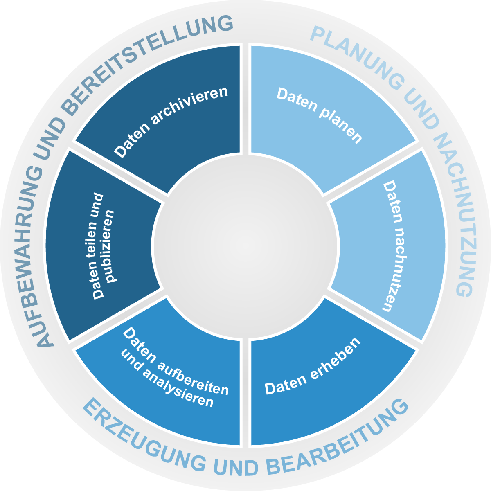

<b>Forschungsdatenmanagement - was ist das überhaupt? 
Welche Inititativen, Materialien und Standards sind für den Einstieg sinnvoll?</b>
 
 
Im Forschungsprozess tauchen an den unterschiedlichsten Stellen Fragen auf - diese FAQ geben zu vielen dieser Fragen eine erste Orientierung.
 
Unterteilt in die verschiedenen Abschnitte des Forschungsdatenlebenszyklus finden Forschende und Infrastrukturpersonal Antworten, Hinweise und Links - basierend auf den Erfahrungen der FDMScout:innen von zehn Hochschulen für angewandte Wissenschaften in NRW.

  

### [Daten planen](D1_Daten_planen.md)
### [Daten nachnutzen](D6_Daten_nachnutzen.md)
### [Daten erheben](D2_Daten_erheben.md)
### [Daten aufbereiten und analysieren](D3_Daten_aufbereiten+analysieren.md)
### [Daten teilen und publizieren](D4_Daten_teilen+publizieren.md)
### [Daten archivieren](D5_Daten_archivieren.md)

### [weitere Antworten für Infrastrukturpersonal](D0_Infrastruktur.md)
